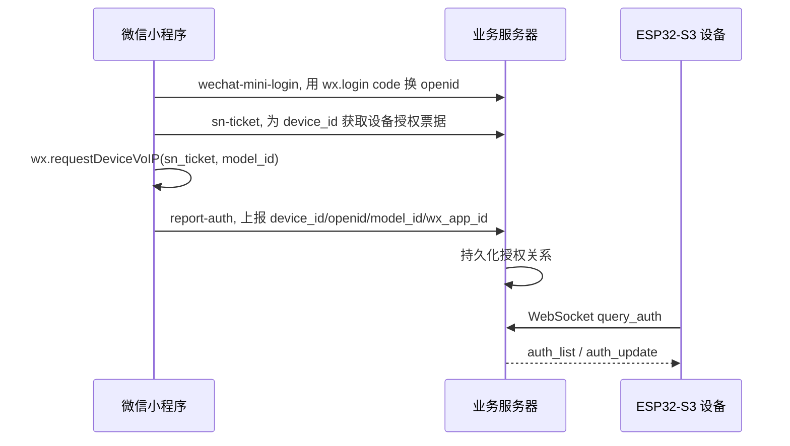

# WeChat VoIP ESP32-S3 示例

这是一个 ESP32-S3 设备接入微信 IoT VoIP 的最小示例, 重点演示 TiRTC 上线、业务 WebSocket、WHIP 建连、BOOT 键交互和示例音频发送流程.

## 示例能力

- 连接 Wi-Fi, 同步系统时间.
- 调用 `TiRtcInit()` / `TiRtcStart()` 让设备上线.
- 连接业务服务器 WebSocket, 上报媒体能力并同步微信授权联系人.
- 接收 `wxa_join_voip_room`, 保存本次 `peer_id` / `token`. 本示例也兼容旧示例服务端的 `wx_join_voip_room`.
- 微信呼入后短按 BOOT 键接听, 长按 BOOT 键拒接.
- 设备空闲时短按 BOOT 键, 使用已缓存联系人请求业务服务器主动呼叫微信.
- 主动呼叫等待微信接听时按 BOOT 键会取消本地等待; 通话中按 BOOT 键会主动挂断.
- 微信端接通前取消呼叫时, 如果业务服务器推 `wxa_user_cancel`, 设备立即结束等待. 本示例也兼容 `wx_user_cancel`.
- 通话已经进入 TiRTC 连接后, 微信侧拒接或挂断会通过 `TIRTC_VOIP_HANGUP` 通知设备.
- WHIP 建连后等待 `TIRTC_VOIP_CALL_CONNECTED`, 确认通话进入媒体阶段后再发送示例提示音.
- 保留对端音频接收入口, 可在 `wechat_voip_media_on_audio()` 中接入播放链路.

## 目录结构

```text
wechat_voip_esp32s3_demo
|- components/tirtc_sdk/          TiRTC SDK 头文件和 ESP32-S3 静态库
|- docs/                          流程说明和交付检查清单
|- main/app_main.c                示例启动顺序
|- main/app_config.h              Wi-Fi 和 BOOT 键配置
|- main/app_version.h             示例版本信息
|- main/system/                   Wi-Fi, SNTP 时间同步, BOOT 键
|- main/tirtc/
|  |- tirtc_config.h              TiRTC 和微信 VoIP 参数
|  |- wechat_voip_trace.h         协议和回调 debug 日志开关
|  |- tirtc_app.c                 TiRTC 上线和 SDK 回调
|  |- wechat_voip_ws.c            业务 WebSocket, 授权缓存, 主动呼叫请求和等待
|  |- wechat_voip_session.c       本次通话状态, 接听, WHIP 建连, 挂断
|  `- wechat_voip_media.c         示例 PCMA 音频发送
`- send_audio.wav                 示例提示音, 编译时嵌入固件
```

## 代码主线

`app_main.c` 只负责启动顺序和 BOOT 键分发:

```text
Wi-Fi -> SNTP -> TiRTC 上线 -> 业务 WebSocket -> BOOT 键 -> 每秒维护状态
```

TiRTC/微信 VoIP 代码各自负责一件事:

| 文件 | 职责 |
|---|---|
| `tirtc_app.c` | 初始化 TiRTC, 注册 SDK 回调, 把音频/命令/断开事件路由给会话模块 |
| `wechat_voip_ws.c` | 连接业务 WebSocket, 上报 `device_media`, 查询 `auth_list`, 发起 `/device/call`, 等待主动呼叫回来的入会通知 |
| `wechat_voip_session.c` | 保存本次 `peer_id/token`, 处理接听、`TiRtcWhipConnect()`, `CALL_CONNECTED`, `HANGUP`, 连接错误和超时回收 |
| `wechat_voip_media.c` | 把 `send_audio.wav` 编码成 8 kHz PCMA 并调用 `TiRtcSendAudioStream()` |

## 必改配置

系统配置在 `main/app_config.h`:

```c
#define APP_WIFI_SSID "your_wifi_ssid"
#define APP_WIFI_PASSWORD "your_wifi_password"
```

TiRTC 和微信 VoIP 配置在 `main/tirtc/tirtc_config.h`:

```c
#define TIRTC_SERVICE_ENDPOINT "http://ep-tirtc.tange365.com"
#define TIRTC_DEVICE_ID "your_device_id"
#define TIRTC_DEVICE_SECRET_KEY "your_device_secret"
#define TIRTC_WX_VOIP_WS_URI "ws://openapidemo.tange365.com/tirtc/voip/device/ws"
#define TIRTC_WX_VOIP_ACTIVE_CALL_VERSION_TYPE 1
#define TIRTC_WX_VOIP_DEBUG_LOG 0
```

`TIRTC_DEVICE_SECRET_KEY` 只用于 TiRTC 设备上线. 示例为了方便演示放在头文件中, 生产环境请改为安全存储或由业务系统安全下发.

`TIRTC_WX_VOIP_DEBUG_LOG` 默认关闭. 需要排查协议和回调时改为 `1`, 串口会输出业务 WebSocket、主动呼叫 HTTP、TiRTC SDK 回调、WHIP、HANGUP、媒体收发采样和 BOOT 触发链路. 正常演示建议保持 `0`.

主动呼叫微信时, `openid` / `model_id` / `wx_app_id` 不需要在固件里手动填写. 设备连上业务服务器后会主动查询 `auth_list`, 并从 `auth_list` / `auth_update` / `wx_user_bind` / `wxa_user_bind` 中缓存授权联系人. 缓存只表示“设备知道可以呼叫谁”, 不会自动拨号. 只有空闲状态短按 BOOT 键后, 设备才会使用缓存信息请求业务服务器发起微信呼叫.

主动呼叫请求不携带自定义 `payload`. `payload` 在微信 VoIP 链路中是可选透传字段, 需要业务服务器和微信回调解析规则完全一致后再启用. 本示例用本地主动呼叫等待状态判断入会方向: 空闲时收到入会通知按微信呼入处理, 主动呼叫等待中收到入会通知则自动建立通话.

## BOOT 键行为

| 当前状态 | 短按 BOOT | 长按 BOOT |
|---|---|---|
| 收到微信呼入, 等待接听 | 接听来电并开始 `TiRtcWhipConnect()` | 拒接来电, 通知业务侧结束本次呼叫 |
| 通话连接中 / 通话中 | 主动挂断当前通话 | 主动挂断当前通话 |
| 通话关闭中 | 等待断开完成 | 等待断开完成 |
| 主动呼叫 HTTP 请求中 / 等待微信接听 | 取消本地等待, 回到空闲 | 取消本地等待, 回到空闲 |
| 空闲 | 使用已缓存的微信授权联系人发起主动呼叫 | 不发起呼叫 |

示例会对中间状态做超时回收:

| 阶段 | 回收规则 |
|---|---|
| 主动呼叫 HTTP 请求中 | 请求成功后进入等待微信接听; 请求失败或被取消后回到空闲 |
| 主动呼叫已提交, 等待微信接听 | 收到取消通知、收到入会通知或等待超时后回到空闲 |
| 微信呼入后未接听 | 35 s 未接听则回到空闲并通知超时 |
| 已开始 `TiRtcWhipConnect()` | 20 s 未建立连接则回到空闲 |
| WHIP 已连接, 等待 `CALL_CONNECTED` | 15 s 未收到确认则进入关闭流程并断开连接 |
| 通话关闭中 | 等待 SDK 断开回调; 超时会重试断开, 不提前伪装为空闲 |

上一通通话真正收到 SDK 断开回调后, 示例仍会保留约 5 s 重拨保护. 这段时间用于等待 SDK 资源、业务服务器和微信侧房间状态完成收尾.

## 联系人从哪里来

设备不会自己从微信查询联系人. 正常业务链路是:



所以如果设备提示微信授权缓存未获取到, 或打开 debug 后看到 `auth_list count=0`, 说明业务服务器当前没有这个 `device_id` 对应的微信授权联系人. 需要先在小程序侧完成授权并调用 `report-auth`, 或确认业务服务器已经实现授权持久化和 `query_auth`.

## 呼叫链路

微信呼入设备:

```text
微信侧呼叫设备
-> 业务服务器收到微信回调
-> 业务服务器生成 TiRTC peer_id/token
-> WebSocket 推 wxa_join_voip_room
-> 设备进入等待接听
-> 短按 BOOT 接听, 或长按 BOOT 拒接
-> TiRtcWhipConnect()
-> CALL_CONNECTED
-> 发送示例音频
```

设备主动呼叫微信:

```text
空闲时按 BOOT
-> POST /tirtc/voip/device/call
-> 业务服务器调用微信 IoT VoIP 主动呼叫接口
-> 微信侧响铃
-> 微信接通前取消时, 业务服务器可推 wxa_user_cancel, 设备回到空闲
-> 微信用户接听
-> 业务服务器收到微信回调
-> WebSocket 推 wxa_join_voip_room
-> 设备识别为主动呼叫回来的入会消息,自动建立通话
-> TiRtcWhipConnect()
-> CALL_CONNECTED
-> 发送示例音频
-> 微信侧拒接或挂断时, TiRTC 下发 HANGUP, 设备释放连接
```

注意: `/device/call` 请求成功只表示微信侧开始响铃. 设备真正入会仍然依赖后续 `wxa_join_voip_room`; 如果此时处于主动呼叫等待中, 设备会自动建立通话.

设备主动呼叫微信且微信未接听时, 设备侧还没有 TiRTC 连接, 不能通过 `TIRTC_VOIP_HANGUP` 通知微信端. 本示例按 BOOT 只取消本地等待并回到空闲; 如果需要微信端立即停止响铃, 业务服务器需要提供设备取消主动呼叫的接口, 并接入微信侧对应取消能力.

## 小程序端和服务端

微信 VoIP 完整链路还需要业务服务器和微信小程序配合. 设备端只负责连接业务 WebSocket、接收 `wxa_join_voip_room`、调用 TiRTC 入会和发送媒体.

服务端和小程序端示例请参考公开仓库. 其中 `weixin-voip-server` 是业务服务端示例, 小程序端代码也在同一仓库中:

- [TiRTC 服务端和小程序示例仓库](https://github.com/tangeai/tirtc-server-example)
- [微信 VoIP 服务端说明](https://github.com/tangeai/tirtc-server-example/blob/main/weixin-voip-server/README.md)

其中服务端负责微信回调、授权联系人持久化、设备 WebSocket 和 `/device/call`; 小程序端负责获取 openid、申请 `sn_ticket`、完成 `wx.requestDeviceVoIP` 授权和发起微信呼叫.

官方文档:

- [微信 VoIP 产品介绍](https://docs.tange.ai/products/wxvoip/overview/what-is-tirtc-voip.html)
- [通话流程](https://docs.tange.ai/products/wxvoip/guides/voip-call-flows.html)
- [集成业务服务端](https://docs.tange.ai/products/wxvoip/guides/app-server.html)
- [集成设备端](https://docs.tange.ai/products/wxvoip/guides/device-integration.html)
- [集成微信小程序](https://docs.tange.ai/products/wxvoip/guides/miniprogram-integration.html)
- [服务端接口](https://docs.tange.ai/products/wxvoip/api-reference/server-api.html)
- [微信 VoIP 通话命令](https://docs.tange.ai/products/wxvoip/api-reference/voip-signaling.html)
- [设备服务请求接口](https://docs.tange.ai/products/wxvoip/api-reference/api-for-service-request.html)
- [诊断与日志](https://docs.tange.ai/products/wxvoip/troubleshooting/diagnostics-and-logs.html)

## 编译环境

当前验证环境:

- 芯片: ESP32-S3
- 目标 OS: FreeRTOS / ESP-IDF
- ESP-IDF: 5.5.4
- 工具链: xtensa-esp32s3-elf-gcc-14.2.0_20260121
- TiRTC SDK: 0.1.4
- 示例版本: 1.0.0

## 内存配置

示例默认面向带 PSRAM 的 ESP32-S3. `sdkconfig.defaults` 已开启 PSRAM, 并把业务任务栈、WebSocket 分片缓冲和大块临时消息优先放到 PSRAM, 让内部 RAM 主要留给 Wi-Fi、LWIP、SDK 和中断相关路径.

连续呼叫或快速按键测试时, 如果需要看资源状态, 可以把 `TIRTC_WX_VOIP_DEBUG_LOG` 临时改成 `1`; 正常演示和交付保持 `0`.

编译:

```powershell
cd <解压目录>\wechat_voip_esp32s3_demo
. C:\esp\v5.5.4\esp-idf\export.ps1
idf.py build
```

烧录和串口查看:

```powershell
idf.py -p COMx flash monitor
```

## 正常日志

```text
微信 VoIP 示例启动: WeChat VoIP ESP32-S3 v1.0.0,发布=2026-06-11,TiRTC=0.1.4
Wi-Fi 已连接,IP=...
系统时间同步完成: ...
TiRTC 版本: 0.1.4
PSRAM: total=8388608 free=...
TiRTC 启动请求已提交
业务连接已建立, 开始同步微信授权缓存
微信授权缓存已就绪
BOOT 键已就绪
收到微信来电消息
请按 BOOT 键接听
BOOT 键接听,正在建立通话
通话连接已建立,等待接通确认
微信通话已接通
示例音频开始发送: 8000Hz,20ms/包
```

设备主动呼叫微信时, 常规日志会保留请求入口和结果:

```text
正在请求微信呼叫: POST http://...
微信呼叫请求返回: ret=ESP_OK status=200 cost=...
微信呼叫请求已提交,等待微信接听,接听后设备自动入会
收到主动呼叫入会消息,自动建立通话
```

`微信呼叫请求返回: ret=ESP_OK status=200` 只表示业务服务器已受理主动呼叫. 设备仍要等后续业务 WebSocket 回推 `wxa_join_voip_room`, 才会真正调用 `TiRtcWhipConnect()` 入会.

## Debug 日志

把 `main/tirtc/tirtc_config.h` 中的 `TIRTC_WX_VOIP_DEBUG_LOG` 改为 `1`, 可以打开协议和回调细节:

```text
[debug] 业务事件: type=wxa_join_voip_room id=... room=...
[debug] 主动呼叫 HTTP 阶段: 解析服务器 host=...
[debug] 主动呼叫 HTTP 阶段: DNS 已完成
[debug] 主动呼叫 HTTP 阶段: 连接服务器
[debug] 主动呼叫 HTTP 阶段: 发送请求
[debug] 主动呼叫 HTTP 阶段: 等待响应
[debug] 主动呼叫 HTTP 阶段: 响应已读取 bytes=...
[debug] SDK 回调 on_command: hconn=... cmdw=...
[debug] 收到 CALL_CONNECTED,启动媒体: hconn=...
```

debug 日志不会打印完整 `peer_id` 和 `token`, 只打印长度和状态, 方便定位卡在业务 WS、HTTP、WHIP、命令回调还是媒体阶段.

## 示例媒体说明

`wechat_voip_media.c` 会把 `send_audio.wav` 嵌入固件, 运行时编码成 8 kHz PCMA, 并按约 20 ms 一包循环发送:

```c
TIRTCFRAMEINFO frame = {
    .stream_id = 0,
    .media = TIRTC_AUDIO_ALAW,
    .flags = TIRTC_AUDIOSAMPLE_8K16B1C,
    .ts = media_ts_ms,
    .length = packet_len,
};

TiRtcSendAudioStream(conn, &frame, audio_data + audio_offset);
```

接入真实音频时, 主要替换音频数据源和编解码链路, 保留 `TIRTCFRAMEINFO` 和 `TiRtcSendAudioStream()` 的调用方式即可.

## 更多文档

- [微信 VoIP 流程说明](docs/WECHAT_VOIP_FLOW.md)
- [交付检查清单](docs/DELIVERY_CHECKLIST.md)
- [示例版本说明](VERSION.md)
- [TiRTC SDK 版本说明](components/tirtc_sdk/VERSION.md)
