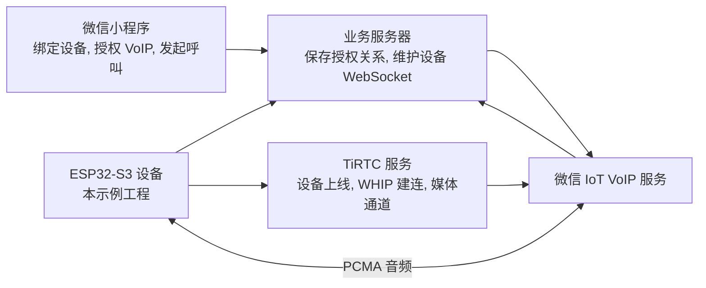
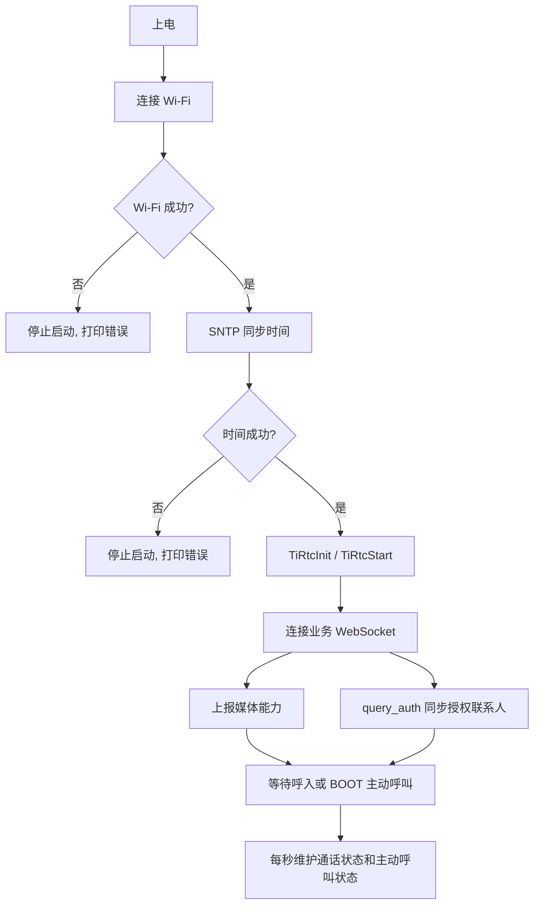
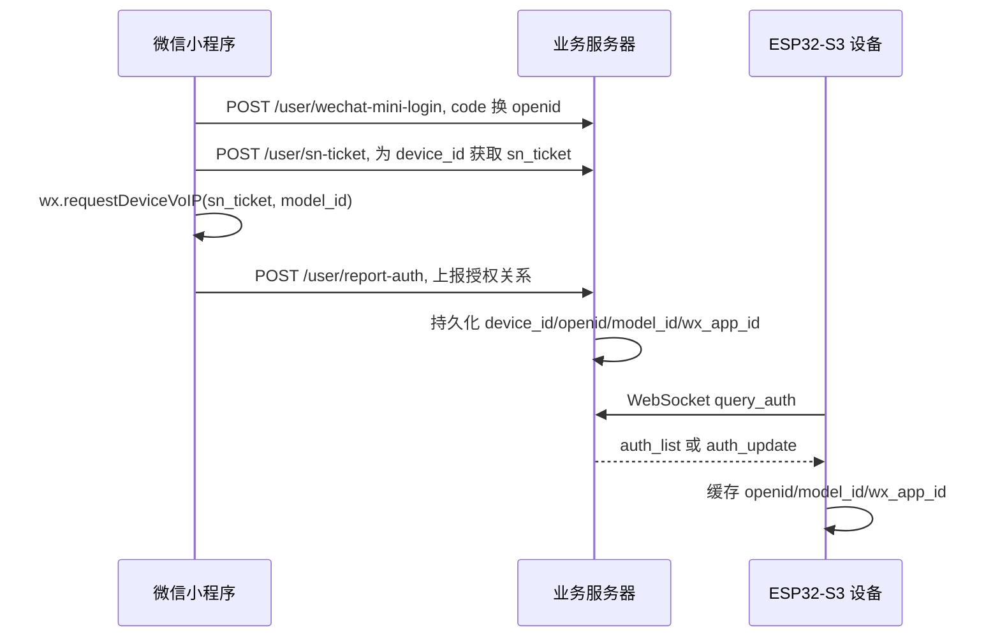
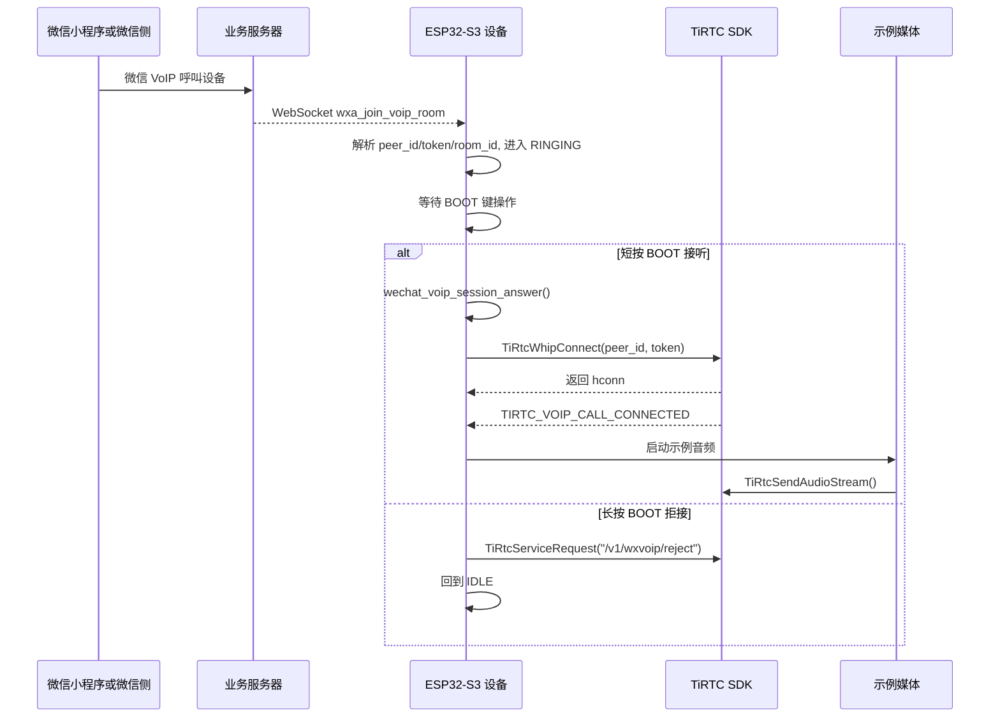
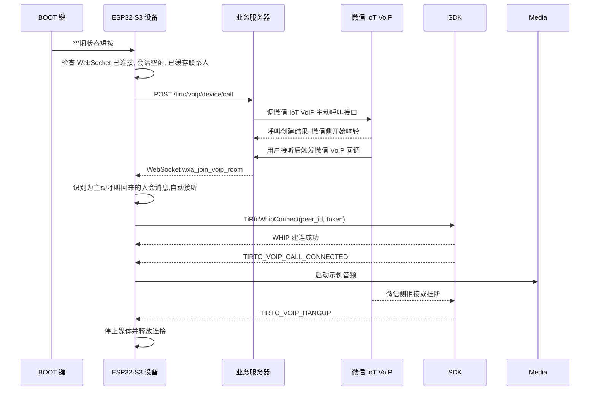
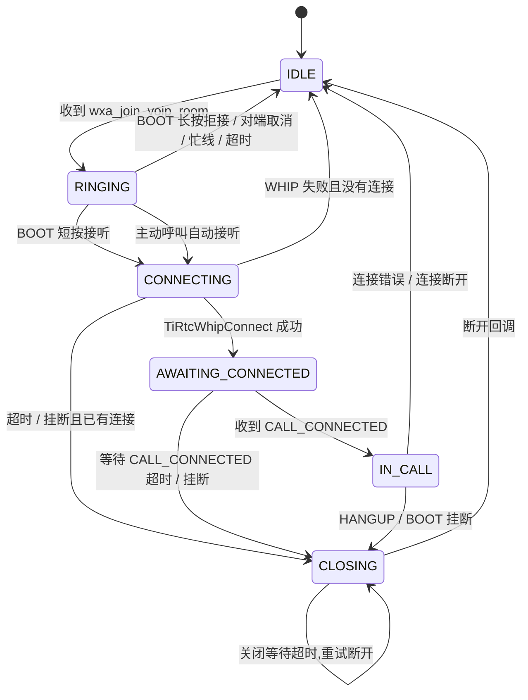
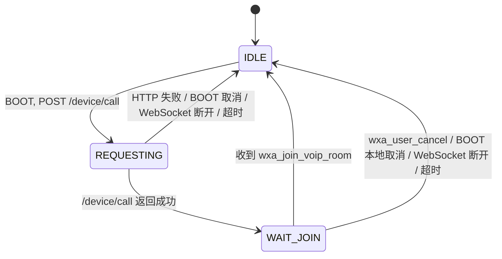
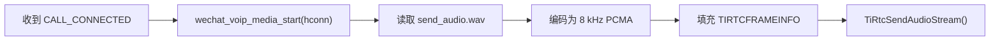

# 微信 VoIP 示例流程说明

本文说明 ESP32-S3 设备端示例的完整接入链路. 本示例只演示 TiRTC 和微信 IoT VoIP 的连接流程, 音频部分使用 `send_audio.wav` 做发送演示.

## 1. 角色关系



分工很简单:

| 角色 | 职责 |
|---|---|
| 微信小程序 | 获取 openid, 申请 `sn_ticket`, 调 `wx.requestDeviceVoIP`, 上报授权关系 |
| 业务服务器 | 保存 `device_id/openid/model_id/wx_app_id`, 下发 `wxa_join_voip_room`, 接收设备主动呼叫请求 |
| ESP32-S3 设备 | TiRTC 上线, 连接业务 WebSocket, 同步授权联系人, 接听呼入, 主动呼叫微信, 发送示例音频 |
| TiRTC SDK | 负责设备上线, WHIP 建连, 音频数据发送和接收 |

## 2. 设备启动



设备启动后需要同时满足两个在线状态:

- TiRTC 在线: `TiRtcStart()` 成功, 设备已经注册到 TiRTC 服务.
- 业务 WebSocket 在线: 设备可以收到业务服务器推送的微信 VoIP 事件.

代码入口保持简单:

| 文件 | 代码职责 |
|---|---|
| `app_main.c` | 启动 Wi-Fi、时间、TiRTC、业务 WebSocket 和 BOOT 键, 并每秒调用状态维护函数 |
| `tirtc_app.c` | 注册 TiRTC 回调, 把命令、音频、断开等事件交给微信 VoIP 会话 |
| `wechat_voip_ws.c` | 管理业务 WebSocket、授权缓存、主动呼叫请求和主动呼叫等待状态 |
| `wechat_voip_session.c` | 管理单次通话状态, 执行接听、WHIP 建连、挂断和超时回收 |
| `wechat_voip_media.c` | 发送示例 PCMA 音频, 保留对端音频接收入口 |

### 内存策略

示例默认运行在带 PSRAM 的 ESP32-S3 上. 业务任务栈、WebSocket 分片缓冲、主动呼叫 HTTP 临时消息和示例媒体任务优先使用 PSRAM, 内部 RAM 主要留给 Wi-Fi、LWIP、SDK 和中断相关路径.

`sdkconfig.defaults` 中保留 64 KB 内部 RAM, 并开启 Wi-Fi/LWIP 尝试使用 PSRAM. 连续呼叫或快速按键测试时, 先确认启动日志中 PSRAM 可用, 再按需打开 `TIRTC_WX_VOIP_DEBUG_LOG` 查看协议阶段.

## 3. 授权联系人从哪里来

设备主动呼叫微信前必须知道目标微信用户. 这份关系由小程序和业务服务器建立:



如果设备提示微信授权缓存未获取到, 或打开 debug 后看到 `auth_list count=0`, 说明服务端没有查到当前 `device_id` 对应的授权联系人. 需要确认小程序已经完成授权并调用 `report-auth`, 且 `device_id` 与设备配置一致.

## 4. 微信呼入



关键点:

- `wxa_join_voip_room` 来自业务 WebSocket, 不是 TiRTC 命令通道. 本示例也兼容旧示例服务端的 `wx_join_voip_room`.
- `peer_id` 和 `token` 是本次 WHIP 建连所需信息.
- 示例默认短按 BOOT 接听, 长按 BOOT 拒接, 便于观察呼入不同处理路径.
- 微信呼入设备时, 收到 `TIRTC_VOIP_CALL_CONNECTED` 后开始发送音频.

## 5. 设备主动呼叫微信



主动呼叫请求使用已缓存的授权联系人:

- `device_id`: 当前设备 ID, 来自 `tirtc_config.h`.
- `wx_user_openid`: 目标微信用户 openid, 来自授权缓存.
- `wx_model_id`: 微信 IoT VoIP model_id, 来自授权缓存.
- `wx_app_id`: 小程序 AppID, 来自授权缓存; 为空时请求不携带.
- `wx_room_type`: 当前示例固定为 `voice`.

主动呼叫请求成功只表示微信侧开始响铃. 设备会进入主动呼叫等待状态, 等业务服务器后续下发 `wxa_join_voip_room`. 处于主动呼叫等待状态时收到入会通知, 设备会自动调用 `TiRtcWhipConnect()` 建立通话. 本示例不携带自定义 `payload`, 也不依赖 `payload` 匹配主动呼叫回来的入会消息.

微信未接听前, 设备侧还没有 TiRTC 连接. 此时按 BOOT 只能取消设备本地等待; 微信端是否立即停止响铃取决于业务服务器是否提供“设备取消主动呼叫”的接口, 并接入微信侧对应取消能力.

结束路径分两类:

- 还没收到入会通知时, 若业务服务器推 `wxa_user_cancel` / `wx_user_cancel`, 或等待超时, 设备会回到空闲.
- 已收到入会通知并进入 TiRTC 连接后, 微信侧拒接或挂断通过 `TIRTC_VOIP_HANGUP` 到达设备, 设备停止媒体并释放连接.

## 6. 状态机

代码里有两个状态域:

- `wechat_voip_session.c`: 管单次 TiRTC 通话.
- `wechat_voip_ws.c`: 管设备主动呼叫微信时, 从 `/device/call` 到入会通知之间的等待.

### 通话状态



通话状态的超时回收:

| 状态 | 超时处理 |
|---|---|
| `RINGING` | 35 s 未接听, 回到空闲并通知超时 |
| `CONNECTING` | 20 s 未完成 WHIP 连接, 回到空闲 |
| `AWAITING_CONNECTED` | WHIP 已建立,等待 `CALL_CONNECTED`; 15 s 未收到确认则发送超时挂断并断开连接 |
| `CLOSING` | 等待 SDK 断开回调; 超时后重试断开, 不伪装为空闲 |

收到 SDK 断开回调并回到 `IDLE` 后, 设备仍会等待约 5 s 才允许再次主动呼叫微信. 这不是通话状态,而是重拨保护,用于等待 SDK 连接释放和业务侧房间状态收尾.

### 主动呼叫等待状态



收到主动呼叫对应的 `wxa_join_voip_room` 后, 主动呼叫等待状态会先回到空闲, 再把入会消息交给 `wechat_voip_session_handle_join_room(..., auto_answer=true)`, 由会话模块自动建立通话.

BOOT 键按当前状态执行动作:

| 状态 | 短按 BOOT | 长按 BOOT |
|---|---|---|
| `RINGING` | 接听 | 拒接并通知业务侧 |
| `CONNECTING` / `AWAITING_CONNECTED` / `IN_CALL` | 挂断 | 挂断 |
| `CLOSING` | 等待断开完成 | 等待断开完成 |
| 主动呼叫 `REQUESTING` / `WAIT_JOIN` | 取消本地等待 | 取消本地等待 |
| 空闲 | 主动呼叫微信 | 不发起呼叫 |

## 7. 音频发送



核心调用:

```c
TIRTCFRAMEINFO frame = {
    .stream_id = 0,
    .media = TIRTC_AUDIO_ALAW,
    .flags = TIRTC_AUDIOSAMPLE_8K16B1C,
    .ts = media_ts_ms,
    .length = packet_len,
};

TiRtcSendAudioStream(conn, &frame, audio_data + audio_offset);
```

接入真实产品时, 把 `send_audio.wav` 换成实际的采集和编码链路即可. 接收方向当前只保留入口, 需要播放时在 `wechat_voip_media_on_audio()` 中把 `data` 送入播放链路.

## 8. 排查顺序

| 日志阶段 | 含义 |
|---|---|
| `Wi-Fi 已连接` | 网络基础可用 |
| `系统时间同步完成` | 鉴权时间可用 |
| `TiRTC 启动请求已提交` | 设备上线流程已提交 |
| `业务连接已建立` | 业务服务器可达 |
| `微信授权缓存已就绪` | 主动呼叫目标信息已就绪 |
| `[debug] 收到微信授权列表` | 业务服务器已响应设备授权查询 |
| `[debug] auth_list count=0` | 服务端没有该设备的授权联系人 |
| `[debug] 已缓存微信呼叫用户` | 授权联系人已写入本地缓存 |
| `正在请求微信呼叫` | 设备已开始 POST `/device/call` |
| `[debug] 主动呼叫 HTTP 阶段: 解析服务器 host=...` | 开始解析 `/device/call` 服务器地址 |
| `[debug] 主动呼叫 HTTP 阶段: DNS 已完成` | DNS 解析已完成 |
| `[debug] 主动呼叫 HTTP 阶段: 连接服务器` | 正在建立 TCP 连接 |
| `[debug] 主动呼叫 HTTP 阶段: 发送请求` | 正在发送 `/device/call` 请求 |
| `[debug] 主动呼叫 HTTP 阶段: 等待响应` | 请求已发出,正在等待业务服务器响应 |
| `微信呼叫请求返回: ret=ESP_OK status=200` | `/device/call` 已被业务服务器受理,微信侧开始响铃 |
| `微信呼叫请求已提交,等待微信接听,接听后设备自动入会` | 微信侧已开始响铃, 设备等待回推入会消息 |
| `通话资源未就绪` | 通话刚结束、工作队列未空或媒体任务未停, 需要稍后再呼叫 |
| `已取消本地主动呼叫等待` | 设备停止等待主动呼叫结果, 微信侧响铃是否结束取决于业务服务器取消链路 |
| `微信侧已取消当前主动呼叫等待` | 业务 WebSocket 收到接通前取消通知, 设备清理当前主动呼叫等待 |
| `微信侧已取消当前来电` | 业务 WebSocket 收到呼入取消通知, 设备清理当前呼入 |
| `收到主动呼叫入会消息,自动建立通话` | 微信已接听设备主动呼叫, 设备开始 WHIP 入会 |
| `收到微信来电消息` | 业务呼入已到设备 |
| `通话连接已建立,等待接通确认` | WHIP 建连成功,等待 `CALL_CONNECTED` |
| `微信通话已接通` | 媒体阶段就绪 |
| `微信通话已结束,原因=...` | TiRTC 命令通道收到对端拒接或挂断 |
| `示例音频开始发送` | 音频发送任务已启动 |
| `微信通话...超时,准备结束` | 通话中间态已触发关闭流程 |
| `微信通话已断开` | SDK 已确认连接断开, 可以再次接听或发起 |
| `微信通话关闭等待超时,重试断开` | SDK 还没有回调断开, 设备继续保持关闭中并重试断开 |

## 9. 小程序端和服务端代码

服务端和小程序端示例请参考:

- [TiRTC 服务端和小程序示例仓库](https://github.com/tangeai/tirtc-server-example)
- [tirtc-server-example / weixin-voip-server README](https://github.com/tangeai/tirtc-server-example/blob/main/weixin-voip-server/README.md)

设备端依赖服务端完成微信回调、授权联系人缓存、设备 WebSocket 和 `/device/call`; 小程序端负责 openid 获取、设备授权和微信侧呼叫入口.

官方文档:

- [产品介绍](https://docs.tange.ai/products/wxvoip/overview/what-is-tirtc-voip.html)
- [通话流程](https://docs.tange.ai/products/wxvoip/guides/voip-call-flows.html)
- [集成业务服务端](https://docs.tange.ai/products/wxvoip/guides/app-server.html)
- [集成设备端](https://docs.tange.ai/products/wxvoip/guides/device-integration.html)
- [集成微信小程序](https://docs.tange.ai/products/wxvoip/guides/miniprogram-integration.html)
- [服务端接口](https://docs.tange.ai/products/wxvoip/api-reference/server-api.html)
- [微信 VoIP 通话命令](https://docs.tange.ai/products/wxvoip/api-reference/voip-signaling.html)
- [设备服务请求接口](https://docs.tange.ai/products/wxvoip/api-reference/api-for-service-request.html)
- [诊断与日志](https://docs.tange.ai/products/wxvoip/troubleshooting/diagnostics-and-logs.html)
